# 🔐 Containerized Demo CAS Server

This script configures a [CAS](https://github.com/apereo/cas) (Central Authentication Service) server by setting variables for the server's `name`, `version`, `URL`, `port`, and `KeyStore` location, as well as variables for `default` and `miscellaneous` user credentials and user attributes. It then constructs a JSON object with complete configuration options for the server and passes this object to a docker container as a command line argument.

```mermaid
graph LR
A[Start] --> B[Set server config variables]
B --> C[Set user config variables]
C --> D[Set attribute config variables]
D --> E[Construct CAS server configs JSON]
E --> F[Remove any existing docker container with same name]
F --> G[Start new docker container]
G --> H[Run docker container in detached mode]
H --> I[Bind local KeyStore file to container file system]
I --> J[Pass CAS server configs JSON to container as command line argument]
J --> K[End]
```

